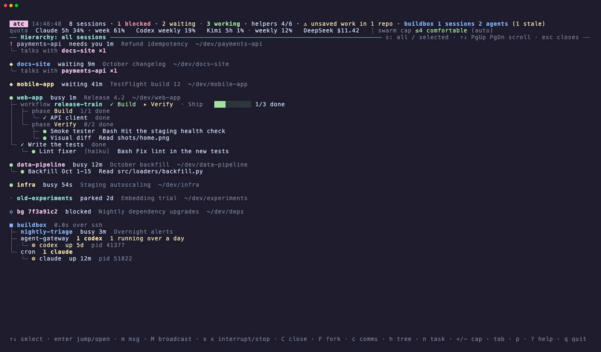
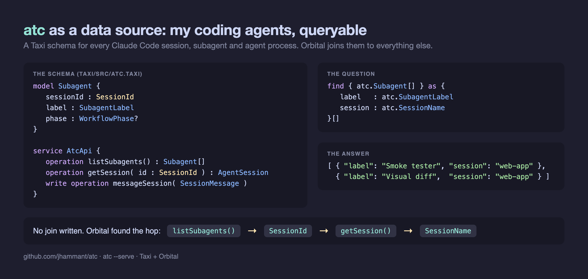

# atc

**Air traffic control for your coding agents.** One terminal screen for every Claude Code session, subagent,
workflow and agent process on your Mac and your servers, with the levers to steer them.

The intro page: [jhammant.github.io/atc](https://jhammant.github.io/atc/)


<sub>Demo data. Arrow into a subagent, drill in, then the hierarchy and comms views.</sub>

## Why

Run a few Claude Code sessions at once, each fanning out subagents and workflows, add a Codex or Kimi job
and an agent on a server, and you lose track: which one is stuck on a permission prompt, which finished an
hour ago and is waiting for you, which background process has been running for five days. `atc` reads what
the agents already write to disk, puts it on one screen, and lets you act on it without hunting for the tab.

## What it shows

- **Blocked on you**: sessions sitting on a permission prompt or a question, and what they are asking
- **Waiting on you**: sessions that finished their turn, with the first line of what they said
- **Working**: what each busy session is doing now, its workflow phases and progress, its subagents, and any
  agent processes it started (`codex`, `kimi`, `claude -p` …)
- **Parked / background / other**: sessions open but idle for 12h+, `claude --bg` sessions, and sessions with
  only a shell running. Listed by default, so nothing open is invisible; `p` folds them away
- **Unsaved work**: each session's repo, checked in the background: uncommitted files, and commits that are on no
  remote yet, so a session isn't closed (or a laptop wiped) with work that only exists on disk
- **Other agents**: agent CLIs running outside any session, with what started them and a `stale?` flag after a day
- **Your servers**: the same view for every machine in `~/.config/atc/hosts`, over ssh
- **Herdr agents**: when [Herdr](https://herdr.dev) is running, the agents in its panes (Codex, opencode, pi …)
- **Hierarchy** (`h`): session › workflow › phase › agent › nested agent › worker process, who talks to whom,
  and each server's agents grouped by what started them

  
- **Comms** (`c`): every message, in full: session to session (✉), the task a session gave each helper (→),
  and the helper's report back (←)
- **Activity**: one merged log of every tool call across every session and helper
- **Quota** (with [quotamax](https://github.com/jhammant/quotamax)): Claude, Codex, Kimi, DeepSeek, and the
  swarm cap that sessions check before fanning out

## Levers

| Key | Does |
|---|---|
| `enter` | Jump to the session's terminal tab (iTerm2, Terminal.app, tmux, Herdr). A background session opens attached in a new tab |
| `enter` on a subagent | Drill in: who started it, its task, every step it took, its report, its own helpers |
| `enter` on a process or server row | Its command, uptime and what started it; on a server's session, an ssh shell there in a new tab |
| `m` | Type a message into the selected session, as if you typed it there. A busy session queues it |
| `M` | The same message to every session in the selected session's project folder |
| `x` `x` | Interrupt the session (Esc). A background session: `claude stop`. An agent process, here or on a server: stop it (SIGTERM, over ssh) |
| `C` `C` / `F` `F` | Type `/closecode` or `/forkcode` into the session: wrap it up, or split work off |
| `+` `-` `0` | Raise, lower or reset the swarm cap (`quotamax override`, pinned for 2h by default) |
| `n` | New task: `route --plan-only` says where it should run (Claude, Codex, Kimi …); `enter` dispatches it in a new tab |
| `c` `h` `tab` `p` `?` `q` | Comms, hierarchy, bottom panel, fold parked sessions away, help, quit |

**Steering never types into a session that is blocked on a prompt.** A permission prompt's default answer is
"Yes", so a message ending in Enter would approve whatever it was asking. `atc` re-reads the session's state
right before typing and skips it; press `enter` to go and answer the prompt yourself. Sessions in Herdr panes
are steered through `herdr agent prompt`, which has the same guard.

## Install

Python 3.9+, standard library only. macOS or Linux.

```bash
git clone https://github.com/jhammant/atc ~/dev/atc
ln -s ~/dev/atc/atc.py ~/.local/bin/atc
atc
```

```bash
atc                  # live view
atc --here           # only sessions in or under this folder: one project's swarm
atc --once           # one frame as text        atc --tree     the hierarchy
atc --comms          # every message            atc --json     the data, for scripts and menu-bar apps
atc --host buildbox  # add a machine for this run (or list them in ~/.config/atc/hosts)
atc --jump <id>      # focus a session's tab    atc --cap up|down|auto   change the swarm cap
atc --open           # open the live view in a new terminal tab
atc --dry-run        # levers say what they would do instead of doing it
atc --serve          # the fleet as JSON for Orbital / Taxi (see below)
```

### Servers

List ssh targets in `~/.config/atc/hosts`, one per line. `atc` runs itself on each over ssh
(`ssh host python3 - --json < atc.py`), so there is nothing to install there; the host needs Python 3.9+ and
key-based ssh. Two names for one machine are shown once. Server rows can be selected: open a process to see
what started it and stop it with `x x`, or press `enter` on a server's session for an ssh shell there.

### Where new sessions open

New sessions (`n`, attaching a background session, server shells) open in the terminal `atc` runs in. Set
`ATC_TERMINAL` to choose: `iterm`, `terminal`, `tmux` (a window in your current tmux), or `tmux-bg`: windows in
a detached `atc` tmux session you can attach to from anywhere, including over ssh from a phone.

### Optional tools

Used when found on `PATH`; override with `ATC_QUOTAMAX`, `ATC_ROUTE`, `ATC_HERDR`, `ATC_CLAUDE`, and `ATC_SSH`
(e.g. `ssh -J bastion`).

- [quotamax](https://github.com/jhammant/quotamax): quota for every provider, and the swarm cap
- `route`: picks where a new task should run
- [Herdr](https://herdr.dev): agents in Herdr panes, steered through Herdr. `atc` only talks to a Herdr
  server that is already running and never starts one, because starting it resumes every saved agent.

## As a Taxi data source and sink (Orbital)



`atc --serve` puts the fleet on HTTP as JSON, and [`taxi/`](taxi/) describes it in
[Taxi](https://taxilang.org), so [Orbital](https://orbitalhq.com) can query your agents next to everything
else it knows, join them to your other data, and steer them.

```bash
atc --serve                    # http://127.0.0.1:7070, reads only
atc --serve --serve-writes     # also: message a session, change the swarm cap (bearer token required)
```

Reads are open on this machine only; bound to any other address, reads need the token too. The token is
`ATC_SERVE_TOKEN`, or `~/.config/atc/serve-token` (made on first use, `0600`, never printed). Writes go through
the same guard as the screen: a session blocked on a prompt is never typed into (`delivered: false`).

| Endpoint | Taxi |
|---|---|
| `GET /api/taxi/sessions`, `/sessions/{id}` | `atc.AgentSession`, `AtcApi::listSessions`, `getSession` |
| `GET /api/taxi/subagents` | `atc.Subagent` |
| `GET /api/taxi/processes` | `atc.AgentProcess` |
| `GET /api/taxi/letters` | `atc.SessionLetter` |
| `GET /api/taxi/quota` | `atc.QuotaReading` |
| `POST /api/taxi/messages` | `write operation messageSession(SessionMessage): MessageResult` |
| `POST /api/taxi/swarm-cap` | `write operation changeSwarmCap(SwarmCapChange): SwarmCapResult` |
| `GET /api/taxi/schema` | the schema itself |

**Point Orbital at it.** Straight from this repo (Orbital polls it, so schema updates arrive on their own), in
your `workspace.conf`:

```hocon
git {
   repositories=[
      { name=atc, uri="https://github.com/jhammant/atc.git", branch=main, path="/taxi" }
   ]
}
```

or copy `taxi/` next to your other projects and add it as a file project. The schema's `@HttpService` points at
`http://host.docker.internal:7070`, which is how Orbital in Docker reaches the host; change it to
`http://localhost:7070` if Orbital runs directly on the machine.

```taxiql
// sessions waiting on a person
find { atc.AgentSession[].filter((atc.SessionState) -> atc.SessionState == "blocked") }

// every subagent with the session it belongs to: Orbital discovers the getSession hop from SessionId
find { atc.Subagent[] } as { label: atc.SubagentLabel  session: atc.SessionName }[]

// steer one
given { message: atc.SessionMessage = { sessionId: "…", text: "status please" } }
call atc.AtcApi::messageSession
```

`atc.RepoRoot` is the join key to the rest of your world: declare your own repo type as inheriting it (or
the other way round) and Orbital will hop from a BugTrack project, a GitHub repo or a deal tied to a product
straight to the agents working on it. [Try the schema in the Taxi playground](https://playground.taxilang.org/?enableDevTools=true#pako:H4sIAAAAAAAA/61Ze48TORL/KlZLp0ukTAY43XLq1YkdBlhmD5a5yQB/EKR1up1pbzp2b9u9IRpGuk+zH2w/yVWVH/3Igzm4gKDbLlfZ9fhVlfs2MVkh1jxJk9NTxm3GuGGcXfNPkuXccmZ0U2eCcZUzI9UqZbYQLNO5VDeM3whlDdMKVqx5Vkgl2Oi85E0u2LmGf4wwRmplJrhK1sw0C7dmMlcoDp9ZVesM6ISjYmt4hgnDFsJuhFAdJr812vIx7cVuNCvF76I2bORXwCY86YRlBVcwgvzMhtdrEpfxajxlM1H/LnK22LJf8LgnJwYHfmEjI9yCq+dnz14/B8oXUpQ5Uxz4w/FsVtD0T7M3PzNpWS1sUysznSuiqDhqCRjeztVcMcZA4An82KbQtONNIWpBQ1/xI452WwnYPh3xImdSAUcJ+p/ZGq0RfyC5Y4S/mqAWJvPv6QgrsWVLXbMbYT27Hf4/w5kOSQD+m4JbOq0p9MakoPqsMVavSVsTBrz7O8iBD2pdK7Ej6lra8pCsnaOcXTCL9CSDXNHJpcEd1v+S6qCegLVUVtQ8s7A19pkteLa6qXUDSz4zWJLXO/xmltsjW12UOlsJXL7h0uIUPOl65Z4qXrvJniANh9gvqDH7Je3oRG9UyhaN2QI7mZeiJ98Uoixb/u/ddl7oEkxykD/FjdsJ8A9HyGUtMqvrbfDvayC7gVCwuqJgLJlewlpwjSXxnxLFr1qq6HJcbW2BzERphKNdKXAhxhe6waCqtAnsR0+bm2uwzwoh4lcQDRDwo7Qvm8UEHIqXBqwOCrUQX0iRN5kdpzCTlRwibQvARfzcwXnUJkq/gvErre0kyCJvkmZAhjxAKIbvm3ohLS/ZRpYlK+DAAZ5AV+tpq+DAeajbluKlNvZYeLkNzRNwJl7Ok+jpxhQUXqhkhDpArZpisBY8NzuoA5qF8xS8qoRC7t+EOudNXQNWn2GsSLvdt3WQLKY3U9j4Uw47ZVcN6YZZYSwAv7Sic5aSwyD4VW4QFxW5bSvtFcy+p8ljGLeUNTApMemARujAHb91IgyXeSe4MHxnItOqy/oCclCXLyAaKzUIA88uOOYh3KBy/mGQRcvxrcr0ei2tFfkLWYo+1y5Z1UAg5udEfIjqpSgrSGg+RA8Q4eyy1JtL2NoRKEJNbDwpq4iWx/TLao4napm+BiApv+yTBZerZgIlgVLCsj//84cz3oAxlQO5XC4FugxbI++eDWrQ1tO9PjRIMMbRQvz1SwU2wmWApzAG+IRBMe74KoGjB9JLAdWLskNrRwyF5X8/KRAqNpAr9GbC/sIaI/Ihu/dCrMrtPm5d+/G81pCMDp8MBfMFID8HLp+hjloDKFq+INAGvzS25uDQmBgyxCBEgFZ1WMmc8+qA6wb+oBdelgDGvjwL9RPUMFtWN8ojBdmFnSGN1xWWLo6LzFnaVhphlMAn7VYIYYaybztFGf1JmFxhEk67KTnMUDC1U7MYW34OMmDaz4hh1uUXmO3lszBbBwxOIxzH3eQaLZIOES1MlxF60haGnvQ2HAAk7eFJpGmGkJDuoESHto8L6RApImXRx4Z0ABaRDHILTvoUQ8N3bWo4ayMVgDjiA41MYDeo0y6G2m4USjvtOM4sMIpOY2Jlusd3Sr6ARWlc9ore9+VI+Dm8SvtYF1WxjmCVtsAVZzdRQxe7SPpU61JwFb1IKonKJuIX4eUQ9THP6eo4gNX5qwsMN0q+UNsYmWMbtY3KHUEXJT5NID7WEjoWV9KdVIir4wmjbgGMRGjqkv10GLeXHg5vj5kf9Unx7Km7nUOALwxhOCwQEd9rfD5gGxPxO22xvHXoqo2Ot9W+VNvhQ5BxYWb0NNR6QLOgQSweNVU80JfGcMW44gQv5+7pFZYD+7bei4LQMUI7Es1h0GZcUT3ORgvocAWl+y3TrpDxHe73rhCAvxQpDYitt+NeaDiOrwQEfN0aZ1nrdUDalL3ovB1QtdUt+bX+ArHfCMIWyZ3590Pk6MGWIpUeDnUCF7M37B/fPXjY06E75r+xG7+CnIf08ZTZvuyb7k3KT/pr+ik23Zd4O3DoU20as24L0iFNpjFj7sxdSqUo7mf9gb2xfzesrYFCQNOL3uNUIdWk84aNzL3L657LvPZ+eT9MteIT6skvusa3Y57vJHnqK2Ga8r7gDeugRa5JYc/i856IxaqcY2NHdWE3k0C4hO6YEA0quXVlJ/5mZNtKslyWlLdxf8/c65dPFcx47u594rFcy+pCCKafxdehv8POmwqqLigBFfzHG6uPiBlqb++2h76D4DzNUQf1lG4eFC/T2FdCg/GM5rCdy6hF7t9PeRQiiB89fPR4+gD+PEwfP3j8wKMPyLjyaBm4hrzjWD9hXj/Us7PC2io9PaU+E9kSL8fqh5cwhzdlMhOjBWTft3XJ/gm9nV+z9yy4fJ64Sty4tezMZmeVbDVFjN9A5cLRDKO1sIXOifOPz6+xQWy8oFNeyVPLP8nTUL8G1vDTgQG0fyaUr2Y0DgnMj3z4OI/Z219X5NJk2vkvNPEpuwFnRn9sr9UgRburuhGP1coELzh9bNZkYsjQQccZuD7ZDO3TEbcpICxCAEz/Dwo4vZX53V4ttBd5I/bDJbfFO15L7CpG8wQa4GQ8qOjZUFOtnr5mf+FW97CFAgWZKLx1zfMVYuO98UGxl4Gi9Qw/9I2iS0qxhwW7FOxP260GvlEuXYAf8gDKxySym5n7EQBtpPG3MpQtAAU6KD2h668lXntRx5kTUGAwTAHZltgXs1FMBqnD+jE4OjQ1A+c/iPuiXks35VIA1ri/NcLgKVL2HLEEavimxEA0G7yjtPeIncs3swMqC58TOlqj/N3RnSdpI+hK0I6e6nwbwz4d5uhxm3od6t/Hsof3SZXJScarIxt1XzVCEhps1H/ySIe5cNwZCht1iQn+JpMEONTbJE2W2Kbf4oXitA1Qdocucevat7Q36Tq4YGg/1/l4cPfhI3DHywg4PwRDkt7eTRJjmwU8frhN4rGQGuT3cAJWAs5WAHo49eF2nsQCZZ6koDjzCNU4T2hjbmi21it33ShqN0l9pJt8B9l+uXXDsYHEKdWUJQ76vhGHbN0IHArtIY6Rq+MgdYGOJ95zzpO7CbvX9t5J00C2wIux++8OEi7eubmZr9giggBsES0hskJfqKqxSeooE2zOJFqAl1de2Wiaj3eTXeu0GaZvmluXYLpnVnHvG7E44VXlht0XGr8rqBeNcON4PeSGO59j3JS7bHWswtnDeGPcBH73cKPuTsiNnm5OQbgbD7dBuzMDWzImHolgN3/103WR7u0Pjn/3AEeH9z048zc30bvKwXFa0L/KweFHNAwllduLv/i/+9+M9hGoP1VQ3or8JwNmcmFzND680w6M5Rz6mOceWIdeBjrKVhd5kpLSEv/hxr3e/RcSvlHAbR4AAA==).

## Tests

```bash
python3 -m unittest discover -s tests -v    # needs tmux
ATC_TEST_PLAYGROUND=1 python3 -m unittest discover -s tests -p test_taxi.py   # the Taxi schema, online
```

The suite builds a fake Claude Code home (sessions blocked on a prompt, waiting, working with nested
subagents and a two-phase workflow, a background session, letters between sessions) and runs dummy
`claude` processes in a hidden tmux session. Unit tests cover the parsers and the model. Screen tests run
`atc` in tmux, press every key, read the screen back as drawn, and check steering in the dummy sessions' own
terminals: a message arrives, a blocked session receives nothing, Esc lands on interrupt. They also fail if
the screen loop ever stalls, or if any command `atc` runs is handed the terminal as its input.

If keys ever seem ignored, `ATC_DEBUG_LOG=/tmp/atc.log atc` logs every refresh and every pass of the screen
loop with how long it took and which keys arrived.

## How it works

Everything is read locally (or over your own ssh); nothing is sent anywhere else.

- `claude agents --json`: Claude Code's own list of active sessions, interactive and background, and whether
  one is waiting for input. Without it, `atc` falls back to `~/.claude/sessions/*.json`.
- `~/.claude/projects/<project>/<session>.jsonl`: the transcripts, read incrementally from near the end, plus
  each session's `subagents/` (with `parentAgentId` for nesting) and workflow journals.
- `ps`: each session's terminal, and agent processes.

The transcript format is Claude Code's internal format and can change between versions; `atc` skips records
it does not understand rather than failing.

## License

MIT
